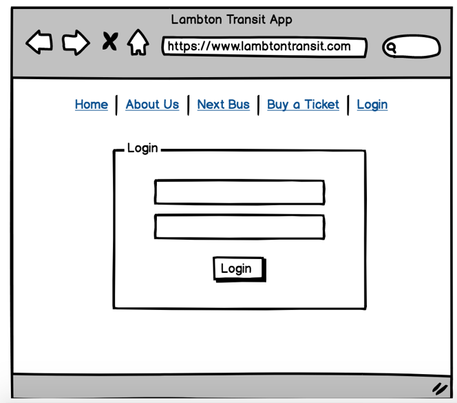

# College-Transit

Lambton College runs a shuttle bus between Toronto and Brampton and Missisauga. There’s only one problem - students never know what time the next bus is.  I solved this problem by creating a web application that shows students when the next shuttle will be arriving.  I used Balsamiq to create a mockup of the app’s screen’s before translating it into code. 

**Technologies:** Balsamiq (wireframing), MySQL, PHP,Spectre (CSS Framework), Twillo, HTML

## Wireframes:
  
  
  
  
  
 
# Production Screenshots:

## Login Screen
 

## SMS Notifications 

 
## Bus Ticket Purchase Page

 
## Upcoming Buses:

 
## Next Bus:
 
 

